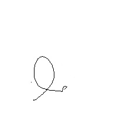

```{r setup, include=FALSE}
#knitr::opts_chunk$set(comment = NA, background = NA, results='asis',  warning = FALSE)

ipak <- function(pkg){
    new.pkg <- pkg[!(pkg %in% installed.packages()[, "Package"])]
    if (length(new.pkg)) 
        install.packages(new.pkg, dependencies = TRUE)
    sapply(pkg, require, character.only = TRUE)
}

packages <- c("tidyverse", "kableExtra", "imager", "magrittr", "tidymodels")
ipak(packages)
```

# Introducción

A partir de un **conjunto de datos de imágenes**, se buscará aplicar técnicas de aprendizaje estadístico para **clasificarlas según un objetivo** o criterio específico.


## Dataset

Conjunto de 86 imágenes de letras manuscritas

* **Formato**: imágenes en formato JPG o PNG

* **Tamaño**: 200 x 200 px





## Objetivo

Para simplificar la tarea de clasificacion en lugar de clasificacion multi-clase en primera instancia se decidio defininir un objetivo de clasificacion binaria. 
Se pretende generar un modelo estadístico que pueda clasificar las imágenes de letras según el siguiente criterio:

* Criterio positivo: **es** una *letra a*

* Criterio negativo: **no es** una *letra a*

## Técnicas

Se utilizarán las siguientes técnicas de aprendizaje estadístico:

* **Regresión logística**

* **Clasificación K-NN**

## Metodología de Trabajo

El proceso de trabajo será el siguiente:

* **Pre-procesamiento**: el conjunto de datos será transformado de modo tal que pueda ser utilizado durante el modelado
* **Definición de modelos**: se ajustarán los modelos definidos para cada técnica con los datos de entrenamiento
* **Evaluación de modelos**: a partir de los modelos ajustados, se estimarán resultados de clasificación sobre los datos de evaluación
* **Conclusión**: se compararán los resultados de clasificación de ambas técnicas


# Preprocesamiento

En esta etapa del flujo de trabajo se transformará el conjunto de datos de modo tal que pueda ser utilizado durante el modelado

## Formato de imágenes

Se utilizará la librería [**ImageR**](https://dahtah.github.io/imager/imager.html).

Esta librería utiliza el formato estándar de imágenes [**CImg**](https://cimg.eu/).

Este formato representa las imágenes como un arreglo numérico *4D* (*x*, *y*, *z*, *c*)

* **x**, **y**: dimensiones espaciales

* **z**: profundidad o tiempo (en secuencia de imágenes)

* **c**: color

## Carga de datos

Se cargan las 86 imágenes en una lista

```{r carga_datos, echo=TRUE, message=FALSE}
imgList <- load.dir("./letras")

glimpse(imgList[1:5])
```

## Transformaciones (1 de 2)

Se realizan las siguientes transformaciones a la lista de imágenes:

* uniformar y reducir tamaño de imgs -- [100,100,z,c]
* eliminar canales de color (grayscale) -- [x,y,1,1]

```{r transforma_datos_1, echo=TRUE, warning=FALSE, message=FALSE}
imgList %<>%
  map(resize, 100, 100) %>%
  map(function(x) as.cimg(as.vector(round(x, digits = 0)))) %>%
  map(grayscale)

```

## Transformaciones (2 de 2)

Se crea matriz de imágenes adecuada para los modelos:

* generar tags de letras a partir de nombres de archivos 
* armar matriz de trabajo [img, v1, ..., v_i, ... , v_(x*y)]

```{r transforma_datos_2, echo=TRUE, warning=FALSE, message=FALSE, out.height= 3}
# fc para leer tags a partir de los nombres de archivos
getBinaryLabel <- function(input) {
  ret <- str_split(input, "/")
  ifelse(str_sub(ret[[1]][length(ret[[1]])], 1, 1) == "a", 1, 2 )
}

binLabels <- names(imgList) %>% map(getBinaryLabel) 

#matriz de imágenes en formato adecuado para modelos
imgMatrix <- as_tibble(cbind(unlist(binLabels), 
                             matrix(unlist(imgList), 
                                    nrow=length(imgList), byrow=TRUE)))

imgMatrix <- rename(imgMatrix, letra = V1) %>% 
  mutate(letra = if_else(letra==1, "aes", "noaes"),
         letra = factor(letra, levels = c("aes", "noaes")))

glimpse(imgMatrix[1:5, 1:10])
```

# Modelado

Durante esta etapa se ajustarán los modelos definidos para cada técnica con los datos de entrenamiento

## Tidymodels

Este framework incluye un conjunto de librerías para modelado y machine learning, y permitirá definir y evaluar los modelos previstos.

## Partición de observaciones

Se divirá el conjunto de imágenes en un conjunto de entrenamiento y otro de evaluación en una proporción de 70 a 30

```{r particion_datos, echo=TRUE, message=FALSE}
set.seed(4096)

#se dividen los datos en entrenamiento y prueba
letras_split <- initial_split(imgMatrix,
                                prop = 0.70,
                                strata = letra)

letras_train <- training(letras_split)
letras_test <- testing(letras_split)

# nro de filas en los datos de entrenamiento y prueba
nrow(letras_train);nrow(letras_test)
```

## Definición y Ajuste del modelo: Regresión Logística (1 de 2)

Usando funciones de *tidymodels* se define el modelo de regresión logística

1. Se llama la función `logistic_reg()` correspondiente al  modelo de regresión logística.

2. Se define el *motor* de modelado con la función `set_engine()` ; en este caso, se agrega **glm** ya que la regresión logística se incluye dentro de los GLM.

3. Se define el modo en el que funcionará el modelo con la función `set_mode()`, en este caso es una clasificación.

4. Se usa la función `fit()` para ajustar el modelo a partir de los datos de entrenamiento.

## Definición y Ajuste del modelo: Regresión Logística (2 de 2)

```{r logistic_train, warning=FALSE}
fitted_logistic_model <- logistic_reg() %>%
  set_engine("glm") %>%
  set_mode("classification") %>%
  fit(letra ~., data = letras_train)

tidy(fitted_logistic_model, exponentiate=TRUE)
```

## Predicción del modelo: Regresión Logística

```{r logistic_test, warning=FALSE}
pred_class <- predict(fitted_logistic_model,
                      new_data = letras_test,
                      type = "class")

pred_proba <- predict(fitted_logistic_model,
                      new_data = letras_test,
                      type = "prob")

letras_results <- letras_test %>%
  select(letra) %>%
  bind_cols(pred_class, pred_proba)

letras_results[1:5, ]
```

## Evaluación del modelo: Regresión Logística (1 de 2)

Se presenta matriz de confusión

```{r logistic_conf_mat, warning=FALSE}
conf_mat(letras_results, truth = letra,
         estimate = .pred_class)
```

## Evaluación del modelo: Regresión Logística (2 de 2)

Métricas de evaluación: Accuracy y Sensibilidad

```{r logistic_metricas, warning=FALSE}
accuracy(letras_results, truth = letra,
         estimate = .pred_class)

sens(letras_results, truth = letra,
         estimate = .pred_class)
```

## Definición y ajuste del modelo: Clasificación K-NN (1 de 2)

También se utilizan funciones de *tidymodels* para realizar una clasificación K-NN

1. Se llama la función `nearest_neighbor()` para definir un modelo que usa las K observaciones más similares del conjunto de entrenamiento para predecir nuevas muestras.

2. Se define el *motor* de modelado con la función `set_engine()` ; en este caso, se utiliza **kknn**.

3. Se define el modo en el que funcionará el modelo con la función `set_mode()`, en este caso es una clasificación.

4. Se usa la función `fit()` para ajustar el modelo a partir de los datos de entrenamiento.


## Definición y ajuste del modelo: Clasificación K-NN (2 de 2)

```{r knn_train, warning=FALSE}
fitted_knn_model <- nearest_neighbor(neighbors = 2) %>% 
  set_engine("kknn") %>% 
  set_mode("classification") %>%
  fit(letra ~., data = letras_train)

fitted_knn_model
```

## Predicción del modelo: Clasificación K-NN

```{r knn_test, warning=FALSE}
pred_class <- predict(fitted_knn_model,
                      new_data = letras_test,
                      type = "class")

pred_proba <- predict(fitted_knn_model,
                      new_data = letras_test,
                      type = "prob")

letras_results <- letras_test %>%
  select(letra) %>%
  bind_cols(pred_class, pred_proba)

letras_results[1:5, ]
```

## Evaluación del modelo: Clasificación K-NN (1 de 2)

Se presenta matriz de confusión

```{r knn_conf_mat, warning=FALSE}
conf_mat(letras_results, truth = letra,
         estimate = .pred_class)
```

## Evaluación del modelo: Clasificación K-NN (2 de 2)

Métricas de evaluación: Accuracy y Sensibilidad

```{r knn_metricas, warning=FALSE}
accuracy(letras_results, truth = letra,
         estimate = .pred_class)

sens(letras_results, truth = letra,
         estimate = .pred_class)
```

# Conclusiones

## Conclusiones (1 de 3)

* Elegimos representar las imágenes como un vector de pixeles, donde cada dimensión representa una posición o pixel de la imagen. De esta manera nuestro conjunto de variables independientes es igual al numero de elementos de este vector (es decir, 10.000 en nuestra implementación).  

* Probamos con dos algoritmos de clasificación supervisados: **regresión logística** y **K-NN**. En el caso de regresión logística, hemos visto que una gran parte de las variables explicativas obtiene un coeficiente distinto de NA. Lo cual consideramos adecuado dado que para ciertas variables (es decir, elementos del vector) todas las instancias de datos tienen el mismo valor.

## Conclusiones (2 de 3)

En términos de performance

* **Regresión logística**: el modelo obtiene un valor de *accuracy* de **0.67** indicando una buena performance. Sin embargo, cuando miramos el estadístico *sensibilidad*, este es bajo **0.25**; dado el desbalance de datos (mayor cantidad de observaciones de la clase *noaes*) el modelo focaliza su ajuste en esta clase. 

* **Clasificación K-NN**: el modelo logra una clasificación relativamente buena para la clase *aes* (*sensibilidad* **0.85**) pero obtiene una mala performance clasificando el resto de las letras. Esta pobre clasificación de *noaes* se puede relacionar a que el conjunto de *noaes* está formado por el complemento de letras (e, i, o, u) las cuales pueden tener distancias lejanas entre ellas y por lo tanto no se clasificadas correctamente dentro de la misma clase.

## Conclusiones (3 de 3)

Otras consideraciones finales incluyen:

* Pruebas preliminares en **K-NN multi-clase** (es decir, todas las posibles letras) arroja similar sesgo del modelo hacia la clase mas numerosa (es decir, letra a).

* Pruebas con **Support Vector Machines (SVM)** no fueron concluidas por error arrojado por la función ksvm() durante el ajuste. Según nuestro entendimiento puede haber alguna incompatibilidad con el vector de pixeles 0s y 1s. Una alternativa a probar como trabajo futuro es con un vector con otro formato.

* Otra pista a explorar en trabajo futuro es aumentar el conjunto de datos inicial con imágenes sintéticas. Estas pueden ser creadas automáticamente aplicando *perturbaciones* tales como rotación o difuminación.
